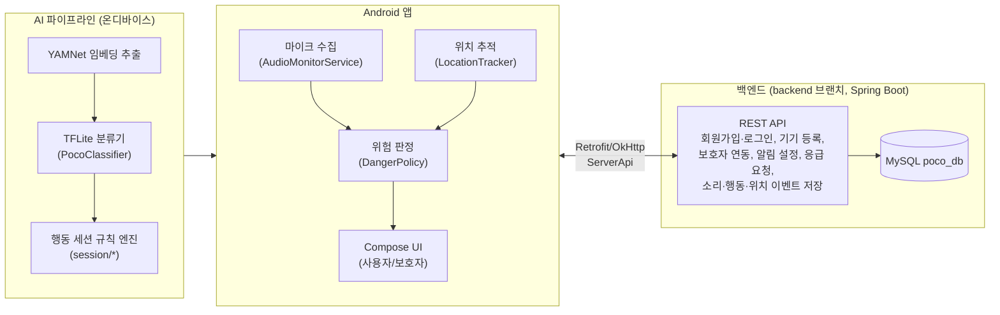

# POCO

**소리로 경도인지장애(MCI) 대상자의 일상을 지키는 온디바이스 AI 돌봄 서비스**

POCO는 스마트폰 마이크로 주변 소리를 실시간으로 분석해 위험 상황(비명, 반복된 경적 등)을 감지하고, 세탁·설거지·식사·청소 같은 생활 패턴을 자동으로 인지해 보호자에게 전달하는 Android 앱입니다. 카메라 없이 소리와 위치 정보만으로 사생활을 침해하지 않으면서 경도인지장애 대상자의 일상 속 이상 징후를 조기에 포착하는 것을 목표로 합니다.

## 배경

카메라 기반 모니터링은 사생활 노출에 대한 부담이 있고, 웨어러블 방식은 사용자가 지속적으로 착용해야 한다는 제약이 있습니다. POCO는 별도 기기 없이 이미 집에 있는 스마트폰 하나로, 소리와 위치 정보만을 활용해 일상 속 위험 신호와 생활 패턴을 파악하는 방식을 선택했습니다.

## 주요 기능

- **실시간 위험 감지**: 마이크로 수집한 오디오를 온디바이스에서 분류해 비명(scream), 반복 경적(car_horn) 등 위험 신호를 즉시 판단하고, 위험 이벤트를 서버에 기록해 보호자 앱에서 확인할 수 있도록 제공
- **생활 패턴(행동 세션) 추론**: 개별 소리 이벤트를 세탁/설거지/식사/청소 등 의미 있는 활동 세션으로 묶어 타임라인·추이(trend)로 제공
- **위치 기반 재실 판단(HOME/OUTSIDE)**: GPS로 재실 상태를 추적해 위험 판단 정책(예: 경적은 외출 중일 때만 후보로 판단)에 반영
- **회원가입/로그인 및 기기 등록**: 이메일 기반 계정 생성 후 역할(사용자/보호자)을 선택하면 앱이 자동으로 기기를 서버에 등록
- **보호자-피보호자 계정 연동**: QR 코드 기반 링크 코드 발급/입력으로 보호자와 피보호자 계정을 연결, 관계(가족/요양보호사/친구/기타) 지정 및 다중 보호자 지원
- **보호자 앱**: 홈 요약, 일일 모니터링, 활동 로그, 추이 그래프, 알림 센터, 긴급 대응(신고/연락) 화면 제공
- **알림 설정**: 긴급·이상행동·배터리·일일요약 알림을 항목별로 on/off하며 서버와 동기화. 마이크 민감도는 기기 등록 시 초기값만 서버로 전달되고, 이후 변경은 현재 로컬 상태로만 동작(서버 미연동)
- **응급 상황 대응(SOS)**: 사용자 또는 보호자가 SOS를 요청하면 서버에 긴급 대응 요청을 기록합니다. 보호자 화면에서 위치 확인·전화 연결 기능을 제공하며, 요청 상태(접수/출동/도착 등)를 앱 내에 기록하지만 119 등 외부 기관과의 실제 연동은 되어 있지 않습니다

## 시스템 구성



AI 모델(TFLite)은 앱에 내장되어 온디바이스로 1차 분류를 수행하며, 분류/세션 결과와 위치·긴급 알림은 REST API를 통해 서버와 동기화됩니다. 백엔드는 이 저장소의 **`backend` 브랜치**에 별도 Spring Boot 프로젝트로 존재합니다(자세한 내용은 [브랜치 구성](#브랜치-구성) 참고). 데이터 모델은 `backend` 브랜치의 [`entity/`](https://github.com/Gwakgarin/poco_project/tree/backend/src/main/java/com/project/poco/entity) 패키지가 최신 기준입니다.

## 브랜치 구성

| 브랜치 | 내용 |
| --- | --- |
| `main` | Android 앱(Kotlin/Compose)과 AI 학습 파이프라인. 이 README가 다루는 기본 브랜치 |
| `backend` | Spring Boot 기반 REST API 서버 (Java 21, Spring Data JPA, MySQL). `main`의 `ServerApi.kt`가 호출하는 API를 구현 |

두 브랜치는 서로 다른 런타임(Android/JVM 서버)이라 병합 없이 독립적으로 유지되며, API 계약은 `main`의 [`ServerApi.kt`](android/app/src/main/java/com/example/poco/ServerApi.kt)와 `backend`의 컨트롤러/엔티티 코드로 맞춰갑니다.

## 기술 스택

| 영역 | 기술 |
| --- | --- |
| Android | Kotlin, Jetpack Compose, Navigation Compose, Material3 |
| 온디바이스 추론 | TensorFlow Lite (LiteRT), YAMNet 임베딩 |
| 네트워킹 | Retrofit2, Gson, OkHttp |
| 위치 | Google Play Services Location |
| AI 모델 학습 | TensorFlow, TensorFlow Hub, scikit-learn, librosa, pandas |
| 백엔드 (`backend` 브랜치) | Java 21, Spring Boot 3, Spring Data JPA, MySQL, Lombok |

## 폴더 구조

```
poco_project/
├── android/                 # Android 앱 (Kotlin, Jetpack Compose)
│   └── app/src/main/java/com/example/poco/
│       ├── AudioMonitorService.kt   # 포그라운드 오디오 모니터링 서비스
│       ├── PocoClassifier.kt        # TFLite 소리 분류기
│       ├── YamNetEmbedder.kt        # YAMNet 임베딩 추출
│       ├── DangerPolicy.kt          # 소리+위치 조합 위험 판정 정책
│       ├── SleepDetector.kt         # 수면 상태 추론
│       ├── ServerApi.kt             # 백엔드 REST API 클라이언트
│       ├── location/                # 재실 판단(HOME/OUTSIDE), 위치 업로드
│       └── ui/screens/              # 사용자·보호자 화면 (Compose)
└── ai/                       # 오프라인 모델 학습·평가 파이프라인
    ├── src/                  # 데이터셋 구축, 증강, 학습, TFLite 변환 스크립트
    ├── src/session/          # 소리 이벤트 → 행동 세션 변환 규칙 (세탁/설거지/식사/청소)
    ├── models/                # 학습된 분류기(.pkl)
    └── data/                  # 학습/평가용 데이터셋
```

## 시작하기

### 요구 사항

| 구성 요소 | 버전 |
| --- | --- |
| Android | compileSdk 36, minSdk 24, targetSdk 36 (Android Studio 최신 버전 권장) |
| 백엔드(`backend` 브랜치) | JDK 21, MySQL 8.x |

### Android 앱 실행

```bash
cd android
./gradlew assembleDebug
```

Android Studio에서 `android/` 디렉터리를 열어 실행할 수도 있습니다. 실행 시 마이크(`RECORD_AUDIO`)와 위치 권한이 필요합니다.

### AI 파이프라인 (모델 학습/재현)

```bash
cd ai
pip install -r requirements.txt
python src/build_dataset.py
python src/train_classifier.py
python src/convert_to_tflite.py
```

### 백엔드 서버 실행 (`backend` 브랜치)

`backend`는 `main`과 공유 파일이 없는 완전히 별개의 Spring Boot 프로젝트입니다. 같은 작업 폴더에서 그냥 `git checkout backend`를 하면 `android/`, `ai/` 디렉터리가 작업 트리에서 통째로 사라져 보이니(히스토리엔 남아있지만 혼란스러움), **별도 폴더에 `git worktree`로 체크아웃하는 것을 권장합니다.**

```bash
git worktree add ../poco-backend backend
cd ../poco-backend

# MySQL에 poco_db 데이터베이스를 만든 뒤, application.properties가 참조하는
# 환경변수를 실제 값으로 설정합니다 (예시는 src/main/resources/application-example.properties 참고)
export DB_URL="jdbc:mysql://localhost:3306/poco_db?useSSL=false&allowPublicKeyRetrieval=true&serverTimezone=Asia/Seoul"
export DB_USERNAME="본인의 MySQL 계정"
export DB_PASSWORD="본인의 MySQL 비밀번호"

./gradlew bootRun
```

Android 앱은 `ServerApiClient.BASE_URL`이 `"http://127.0.0.1:8080/"`으로 하드코딩되어 있어(`android/app/src/main/java/com/example/poco/ServerApi.kt`), 에뮬레이터에서 로컬 백엔드에 붙이려면 **`adb reverse tcp:8080 tcp:8080`으로 포트를 연결해야 합니다.** (에뮬레이터의 호스트 게이트웨이 주소인 `10.0.2.2`는 코드에서 쓰고 있지 않으므로, 이 방식으로 테스트하려면 `BASE_URL`을 직접 `http://10.0.2.2:8080/`으로 바꿔야 합니다.)

## 테스트

```bash
cd android
./gradlew test
```

- `DangerPolicyTest`(4개): scream/car_horn 등 환경음 종류, HOME/OUTSIDE 위치 상태, 반복 횟수·경과 시간에 따른 위험 판단 정책 검증
- `HomeStateMachineTest`(4개): 위치 정확도·좌표에 따른 HOME/OUTSIDE 상태 전환 및 불확실한 값 처리 검증
- 위 8개 외에 Android 프로젝트 생성 시 기본 포함되는 보일러플레이트 테스트(`ExampleUnitTest` 등)가 있으나 프로젝트 로직 검증과는 무관해 위 개수에서 제외했습니다.
- `backend` 브랜치에는 Spring Boot 기본 생성 시 포함되는 컨텍스트 로딩 테스트(`PocoApplicationTests`) 외에 별도 로직 테스트가 아직 없습니다.

## 현재 상태 및 알려진 한계

Android 에뮬레이터에서 로그인부터 SOS까지 프론트엔드–백엔드 연동을 테스트하며 확인한, 아직 해결되지 않은 부분입니다.

- **배포 주소 미정**
  - 현재 상태: `BASE_URL`이 로컬(`127.0.0.1:8080`)로 고정되어 있습니다.
  - 발생 가능한 영향: 실제 배포 서버가 준비되어도 앱 코드를 직접 수정하기 전까지는 붙일 수 없습니다.
  - 개선 방향: 배포 주소가 정해지면 `BASE_URL`을 교체하거나, 빌드 설정(예: BuildConfig)으로 분리할 예정입니다.
- **연동된 사용자/보호자의 실제 이름 표시 불가**
  - 현재 상태: 백엔드의 `UserLinkResponse`에 상대방 이름 필드가 없습니다.
  - 발생 가능한 영향: 보호자 연동 관리 화면에서 관계 라벨(가족/요양보호사 등)만 보이고 실제 이름은 표시되지 않습니다.
  - 개선 방향: 사용자 조회용 API가 추가되면 실제 이름을 표시하도록 연결할 예정입니다.
- **마이크 감도 설정 서버 미연동**
  - 현재 상태: 기기 등록 시 초기값(`micSensitivity`)만 서버로 전달되고, 이후 값을 변경해 서버에 반영하는 API가 없습니다.
  - 발생 가능한 영향: 설정 화면에서 마이크 감도를 바꿔도 로컬에만 반영되고 서버·다른 기기와는 동기화되지 않습니다.
  - 개선 방향: 마이크 감도 갱신용 API가 추가되면 다른 알림 설정과 동일하게 서버 동기화로 전환할 예정입니다.
- **기기 등록(`registerDevice`) 요청의 멱등성 미지원**
  - 현재 상태: 네트워크 재시도 등으로 동일 사용자의 기기 등록 요청이 중복되면 `devices.user_id` UNIQUE 제약으로 서버가 오류를 반환합니다.
  - 발생 가능한 영향: 앱(`PocoNavHost.kt`)은 실패 시 기존에 등록된 기기를 다시 조회해 복구하지만, 백엔드 자체는 여전히 이 상황을 오류로 처리합니다.
  - 개선 방향: 백엔드 등록 API를 멱등하게 변경하거나, 중복 등록 시 기존 기기 정보를 반환하도록 수정할 예정입니다.
