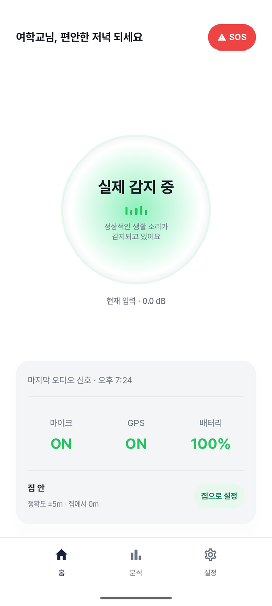
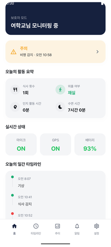
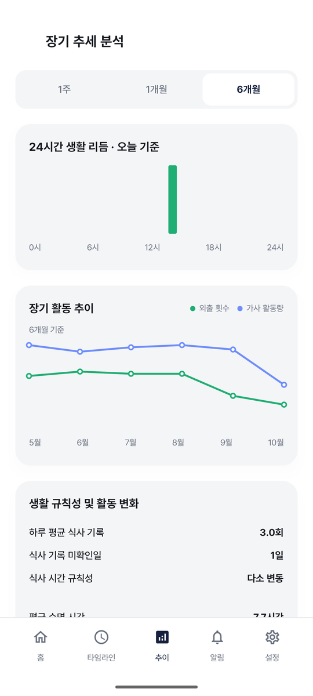
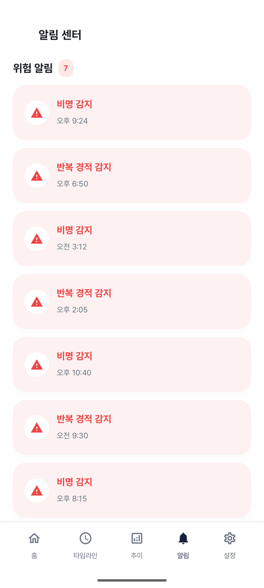
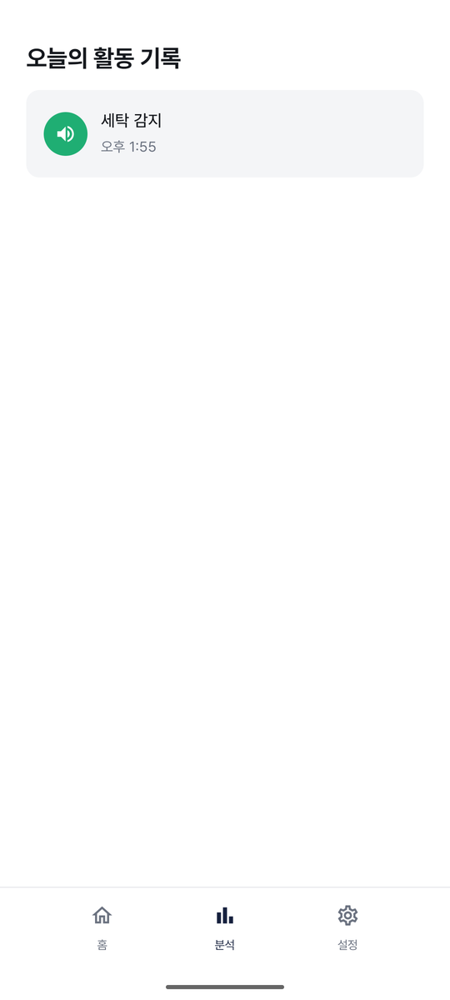
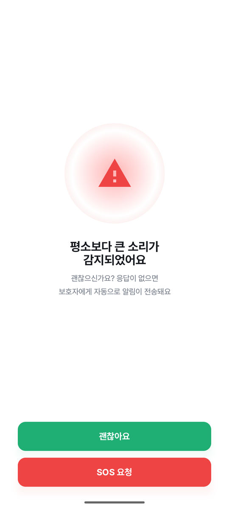
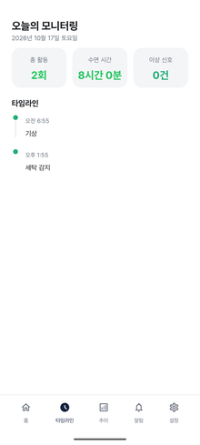
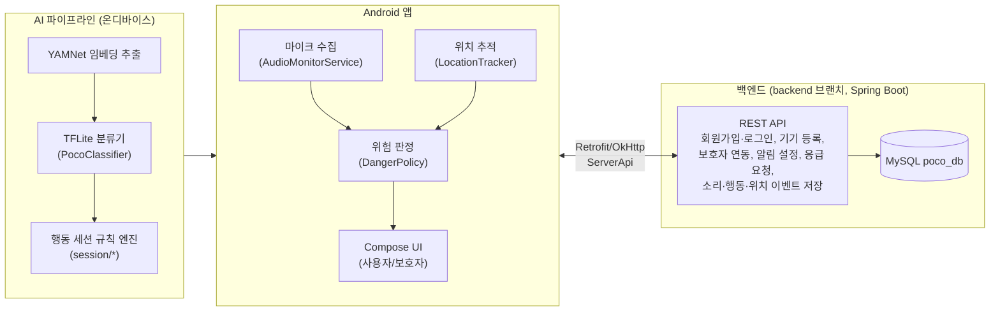

<p align="center">
  
</p>

<h1 align="center">POCO</h1>

<p align="center">
  <b>소리로 지키는 가족의 하루</b><br>
  경도인지장애(MCI) 대상자를 위한 온디바이스 AI 돌봄 서비스
</p>

<p align="center">
  
  
  
  
  
</p>

<p align="center">
  카메라도, 웨어러블도 없이.<br>
  집에 있는 스마트폰 한 대가 <b>소리와 위치</b>만으로 일상을 지켜보고 보호자에게 전합니다.
</p>

<table align="center">
  <tr>
    <td align="center" width="200"></td>
    <td align="center" width="200"></td>
    <td align="center" width="200"></td>
    <td align="center" width="200"></td>
  </tr>
  <tr>
    <td align="center"><b>소리로 지켜봐요</b></td>
    <td align="center"><b>하루를 한눈에</b></td>
    <td align="center"><b>변화를 놓치지 않아요</b></td>
    <td align="center"><b>위험은 바로 알려요</b></td>
  </tr>
</table>

---

## 개요

혼자 지내는 경도인지장애 대상자는 위급한 상황이 생겨도 스스로 알리기 어렵고, 가족은 평소와 얼마나 달라졌는지 알기 어렵습니다. 카메라는 사생활 부담이 크고 웨어러블은 항상 착용해야 한다는 한계가 있습니다.

POCO는 이미 집에 있는 스마트폰 한 대로 이 문제를 풉니다.

- **위험 즉시 알림**: 비명, 집 밖 반복 경적을 감지하면 사용자에게 확인 화면을 띄우고 보호자에게 푸시를 보냅니다.
- **일상 패턴 기록**: 세탁, 식사, 설거지, 청소, 대화·TV 소리와 취침·기상, 외출을 활동으로 기록합니다.
- **변화 추적**: 1주부터 6개월까지 추이를 분석하고, 평소와 크게 달라지면 이상 탐지 알림을 줍니다.

녹음 파일은 분석이 끝나면 기기에서 바로 지워지고, 서버에는 오디오 없이 파일명과 분류 결과만 저장됩니다.

한이음 ICT 멘토링 프로젝트로 진행했습니다 (팀 여학교의 별).

## 화면

**사용자 모드** · 돌봄 대상자의 폰

| 홈 | 분석 | 큰 소리 확인 |
| :---: | :---: | :---: |
|  |  |  |
| 실시간 소리 감지 상태, 재실 여부, 배터리 | 오늘 감지된 활동 기록 | 평소보다 큰 소리가 들리면 확인, SOS 요청 가능 |

**보호자 모드** · 보호자의 폰

| 홈 | 타임라인 | 추이 | 알림센터 |
| :---: | :---: | :---: | :---: |
|  |  |  |  |
| 오늘의 활동 요약, 실시간 상태, 최근 위험 알림 | 오늘의 행동 기록 | 1주·1개월·6개월 활동 추이와 생활 규칙성 | 위험 알림, 이상 탐지 알림 |

## 소리 인식과 판정

소리 이벤트를 규칙으로 묶어 활동으로 기록합니다.

| 대상 | 소리 | 판정 |
| --- | --- | --- |
| 비명 | scream | 감지 즉시 위험 알림 (위치 무관) |
| 반복 경적 | car_horn | 집 밖에서 30초 안에 3회 이상이면 위험 후보. 집 안이거나 위치가 불확실하면 제외 |
| 세탁 | 세탁기 | 20분 이상 지속 |
| 청소 | 청소기 | 2분 이상 지속 |
| 인지 활동 | 대화, TV | 5분 이상 지속 |
| 식사 | 전자레인지·조리 → 그릇 소리 | 조리 뒤 그릇 소리가 이어지면 확정 |
| 설거지 | 물소리 → 그릇 소리 | 직전 60분 안에 전자레인지 소리가 없을 때만 별도 기록 |
| 수면 | 폰 움직임 | 30분 무활동이면 취침, 5분 움직이면 기상 |

식사 직후 이어지는 설거지는 식사에 포함됩니다. 실제 앱 동작은 `session/*` Kotlin 코드를 따르며, `ai/src/session/`은 오프라인 검증용입니다.

## 설계 포인트

- **온디바이스 추론**: YAMNet 임베딩과 TFLite 분류기를 앱에서 직접 실행합니다. 오디오가 기기를 떠나지 않아 사생활 부담과 네트워크 의존이 적습니다.
- **소리와 위치를 함께 판단**: 경적은 집 밖에서 반복될 때만 위험 후보로 봅니다. 집 안에서 나는 경적 소리(TV 등)로 인한 오탐을 줄입니다.
- **상태 머신 기반 활동 세션**: 지속 시간, 재감지 간격, 종료 시점을 규칙으로 정해 단발성 소리를 활동 단위로 묶습니다. 같은 규칙을 Python으로도 구현해 데이터로 검증했습니다.
- **데이터 누수 방지**: 분류기 학습·평가 데이터를 원본 음원 단위로 나눠 같은 녹음이 양쪽에 섞이지 않게 했습니다.
- **변화 감지**: 기간별로 외출, 가사 활동, 식사 규칙성을 집계하고, 이전 기간보다 20% 이상 달라지면 이상 탐지 알림을 만듭니다.
- **유실 대비**: 외출·귀가 이벤트는 전송에 실패하면 재시도하고, 앱을 다시 켜면 상태를 복원합니다.
- **실서비스 구성**: AWS에 배포한 Spring Boot API, FCM 푸시, QR 기반 보호자 연동(다중 보호자 지원)으로 실제 두 대의 폰이 연결됩니다.
- **테스트**: 위험 판정 정책, 재실 상태 전환, 추이 집계에 단위 테스트 61개가 있습니다.

## 주요 기능

**사용자 모드**
- **실시간 소리 인식**: 마이크 입력을 온디바이스에서 분류하고, 큰 소리를 분석하는 동안에는 "소리 분석 중"으로 표시합니다.
- **생활 패턴 기록**: 세탁, 식사, 설거지, 청소, 대화·TV 소리를 활동으로 묶어 "오늘의 활동 기록"으로 보여주고, 폰의 움직임으로 취침·기상 시각도 추정합니다.
- **재실 판단**: GPS로 집 안(HOME)과 집 밖(OUTSIDE)을 구분합니다. 집 위치는 "집으로 설정"으로 지정합니다.
- **큰 소리 확인과 SOS**: 비명·반복 경적이 감지되면 "괜찮으신가요?" 확인 화면이 자동으로 뜹니다. SOS를 요청하면 서버에 긴급 요청이 기록되고 보호자에게 푸시가 전달됩니다. 119 등 외부 기관과의 실제 연동은 되어 있지 않습니다.
- **설정**: 마이크 감도, 알림 설정, 보호자 연동 관리(QR 초대), 계정 정보를 제공합니다.

**보호자 모드**
- **홈**: 식사 횟수, 재실/외출 상태, 인지 활동 시간, 수면 시간, 마이크·GPS·배터리 상태와 오늘의 일간 타임라인을 한눈에 보여줍니다. GPS 카드를 누르면 사용자의 마지막 위치 지도로 이동합니다.
- **타임라인**: 오늘 감지된 행동 기록을 시간 순서대로 제공합니다.
- **추이**: 1주, 1개월, 6개월 단위로 외출 횟수와 가사 활동량, 하루 평균 식사 기록, 식사 시간 규칙성, 평균 수면 시간을 보여줍니다.
- **알림센터**: 비명·반복 경적 같은 위험 알림과 활동 변화를 알리는 이상 탐지 알림(외출 빈도 급감, 인지활동 감소, 식사 불규칙)을 모아 보여줍니다.
- **긴급 대응**: 위험 푸시를 누르면 긴급 화면으로 바로 이동해 위치 확인, 전화 연결, 긴급 상황 알리기를 할 수 있습니다.
- **설정**: 사용자 연동 정보, 알림 수신 설정, 새 사용자 연동하기(QR 스캔)를 제공합니다.

**공통**
- 이메일 기반 회원가입·로그인, 역할(사용자/보호자) 선택, 기기 자동 등록
- QR 코드 기반 보호자 연동과 관계 지정(가족/요양보호사/친구/기타), 다중 보호자 지원
- 사용자 폰의 배터리 잔량이 바뀔 때마다 서버에 올라가 보호자 화면에 표시

## 시스템 구성


```mermaid
flowchart LR
    subgraph Android["Android 앱"]
        A["마이크 수집\n(AudioMonitorService)"] --> B["위험 판정\n(DangerPolicy)"]
        L["위치 추적\n(LocationTracker)"] --> B
        B --> UI["Compose UI\n(사용자/보호자)"]
    end

    subgraph AI["AI 파이프라인 (온디바이스)"]
        E["YAMNet 임베딩 추출"] --> C["TFLite 분류기\n(PocoClassifier)"]
        C --> S["행동 세션 규칙 엔진\n(session/*)"]
    end

    subgraph Backend["백엔드 (backend 브랜치, Spring Boot)"]
        API["REST API\n회원가입·로그인, 기기 등록,\n보호자 연동, 알림 설정, 응급 요청,\n소리·행동·위치 이벤트 저장"]
        DB[(MySQL poco_db)]
        API --> DB
    end

    Android <-->|Retrofit/OkHttp\nServerApi| API
    AI --> Android
```

AI 모델(TFLite)은 앱에 내장되어 온디바이스로 1차 분류를 수행하며, 분류·세션 결과와 위치·긴급 알림은 REST API를 통해 서버와 동기화됩니다. 백엔드는 이 저장소의 **`backend` 브랜치**에 별도 Spring Boot 프로젝트로 존재합니다. 데이터 모델은 `backend` 브랜치의 [`entity/`](https://github.com/Gwakgarin/poco_project/tree/backend/src/main/java/com/project/poco/entity) 패키지가 최신 기준입니다.

## 기술 스택

| 영역 | 기술 |
| --- | --- |
| Android | Kotlin, Jetpack Compose, Navigation Compose, Material3 |
| 온디바이스 추론 | TensorFlow Lite (LiteRT), YAMNet 임베딩 |
| 네트워킹 | Retrofit2, Gson, OkHttp |
| 위치 | Google Play Services Location |
| AI 모델 학습 | TensorFlow, TensorFlow Hub, scikit-learn, librosa, pandas |
| 백엔드 (`backend` 브랜치) | Java 21, Spring Boot 3, Spring Data JPA, MySQL, Lombok |

## 시작하기

| 구성 요소 | 버전 |
| --- | --- |
| Android | compileSdk 36, minSdk 24, targetSdk 36 (Android Studio 최신 버전 권장) |
| 백엔드(`backend` 브랜치) | JDK 21, MySQL 8.x |

### Android 앱 실행

```bash
cd android
./gradlew assembleDebug
```

Android Studio에서 `android/` 디렉터리를 열어 실행할 수도 있습니다. 실행 시 마이크(`RECORD_AUDIO`)와 위치 권한이 필요합니다.

보호자 위치 확인 화면의 Google 지도를 띄우려면 `android/local.properties`에 Maps API 키를 넣어야 합니다 (이 파일은 깃에 올라가지 않습니다). 키가 없어도 빌드·실행은 되며 지도 영역만 회색으로 표시됩니다.

```properties
MAPS_API_KEY=여기에_발급받은_키
```

Google Cloud 콘솔에서는 **Maps SDK for Android**만 사용 설정하고, 키의 API 제한도 그 하나로 걸어 두세요. 지도 표시는 무료이며, 길찾기·장소 검색 같은 과금 API는 앱에서 호출하지 않습니다.

### AI 파이프라인 (모델 학습/재현)

```bash
cd ai
pip install -r requirements.txt
python src/build_dataset.py
python src/train_classifier.py
python src/convert_to_tflite.py
```

<details>
<summary>백엔드 코드를 직접 수정·테스트하고 싶을 때 (로컬 실행, 참고용)</summary>

`backend`는 `main`과 공유 파일이 없는 완전히 별개의 Spring Boot 프로젝트입니다. 같은 작업 폴더에서 그냥 `git checkout backend`를 하면 `android/`, `ai/` 디렉터리가 작업 트리에서 통째로 사라져 보이니(히스토리엔 남아있지만 혼란스러움), **별도 폴더에 `git worktree`로 체크아웃하는 것을 권장합니다.**

```bash
git worktree add ../poco-backend backend
cd ../poco-backend

export DB_URL="jdbc:mysql://localhost:3306/poco_db?useSSL=false&allowPublicKeyRetrieval=true&serverTimezone=Asia/Seoul"
export DB_USERNAME="본인의 MySQL 계정"
export DB_PASSWORD="본인의 MySQL 비밀번호"

./gradlew bootRun
```

Android 앱의 `ServerApiClient.BASE_URL`(`android/app/src/main/java/com/example/poco/ServerApi.kt`)은 기본적으로 `http://3.25.227.173:8080/`(AWS EC2에 배포된 실제 서버)를 가리킵니다. 로컬 백엔드로 다시 테스트하려면 이 값을 아래 중 하나로 바꿔주세요.

- 에뮬레이터에서 로컬 백엔드에 붙일 때: `BASE_URL`을 `"http://10.0.2.2:8080/"`으로 변경
- USB + `adb reverse tcp:8080 tcp:8080`으로 실기기 연결할 때: `"http://127.0.0.1:8080/"`으로 변경

</details>

## 브랜치 구성

| 브랜치 | 내용 |
| --- | --- |
| `main` | Android 앱(Kotlin/Compose)과 AI 학습 파이프라인. 이 README가 다루는 기본 브랜치 |
| `backend` | Spring Boot 기반 REST API 서버 (Java 21, Spring Data JPA, MySQL). `main`의 [`ServerApi.kt`](android/app/src/main/java/com/example/poco/ServerApi.kt)가 호출하는 API를 구현 |

두 브랜치는 서로 다른 런타임(Android/JVM 서버)이라 병합 없이 독립적으로 유지되며, API 계약은 `ServerApi.kt`와 `backend`의 컨트롤러/엔티티 코드로 맞춰갑니다.

<details>
<summary>폴더 구조</summary>

```
poco_project/
├── android/                 # Android 앱 (Kotlin, Jetpack Compose)
│   └── app/src/main/java/com/example/poco/
│       ├── AudioMonitorService.kt   # 포그라운드 오디오 모니터링 서비스
│       ├── PocoClassifier.kt        # TFLite 소리 분류기
│       ├── YamNetEmbedder.kt        # YAMNet 임베딩 추출
│       ├── DangerPolicy.kt          # 소리+위치 조합 위험 판정 정책
│       ├── SleepDetector.kt         # 수면 상태 추론
│       ├── ServerApi.kt             # 백엔드 REST API 클라이언트
│       ├── session/                 # 소리 이벤트 → 행동 세션 (세탁/식사/설거지/청소/인지활동)
│       ├── location/                # 재실 판단(HOME/OUTSIDE), 위치 업로드
│       ├── push/                    # FCM 푸시 알림
│       └── ui/                      # 화면(Compose), 공통 컴포넌트, 테마
├── ai/                       # 오프라인 모델 학습·평가 파이프라인
│   ├── src/                  # 데이터셋 구축, 증강, 학습, TFLite 변환 스크립트
│   ├── src/session/          # 행동 세션 규칙의 Python 구현과 검증
│   ├── models/               # 학습된 분류기(.pkl)
│   └── data/                 # 학습/평가용 데이터셋
└── docs/images/              # README 이미지
```

</details>

## 테스트

```bash
cd android
./gradlew test
```

- `DangerPolicyTest`(4개): scream/car_horn 등 환경음 종류, HOME/OUTSIDE 위치 상태, 반복 횟수·경과 시간에 따른 위험 판단 정책 검증
- `HomeStateMachineTest`(4개): 위치 정확도·좌표에 따른 HOME/OUTSIDE 상태 전환 및 불확실한 값 처리 검증
- `TrendAggregatorTest`(42개), `TrendUiStateMapperTest`(11개): 추이 화면의 기간별 집계, 변화율, 규칙성 계산과 UI 상태 변환 검증
- 위 61개 외에 Android 프로젝트 생성 시 기본 포함되는 보일러플레이트 테스트(`ExampleUnitTest`)가 있으나 프로젝트 로직 검증과는 무관해 제외했습니다.
- `backend` 브랜치에는 Spring Boot 기본 생성 시 포함되는 컨텍스트 로딩 테스트(`PocoApplicationTests`) 외에 별도 로직 테스트가 아직 없습니다.
