# POCO ERD (백엔드 API 스펙 기반)

작성 기준: `poco 프론트엔드 보고 - POCO 백엔드 API 요청 스펙` (2026-07-26)
업데이트: 2026-08-03

## 설계 원칙

- **저장이 필요한 데이터만 테이블로 만듦.** 홈 요약/타임라인/추이(trend) 등은 원본 이벤트(sound_events, behavior_events, outing_events)를 조합해 계산하는 **조회 API**이지, 별도 테이블이 아님 (스펙의 "역할 분담 제안" 참고: 백엔드는 저장소 + 원본 로그 GET만 담당, 집계/이상탐지/요약은 AI 파트).
- 인증은 토큰 기반이므로 대부분의 FK는 "토큰에서 식별된 user_id"로 채워짐. URL에 userId를 노출하지 않는다는 긴급상황 API의 요구사항을 전 테이블에 동일하게 적용. (토큰 발급/검증 로직은 아직 미구현 — 현재는 userId/deviceId를 요청 파라미터로 직접 받는 중. 로그인 붙일 때 정리 필요)
- `devices`를 사용자(피보호자)와 분리한 이유: 마이크 감도, 배터리, GPS on/off, 마지막 위치 등은 "사람"이 아니라 "기기" 속성이라 향후 기기 교체/다중 기기 확장에 대비.
- 기기 식별자가 현재 두 갈래로 나뉘어 있음: `devices` 테이블은 `users.id` 기반(bigint, 회원가입 시 생성), 반면 앱이 실제 쓰는 `deviceId`는 로그인과 무관하게 앱 설치 시 자동 생성되는 String UUID(`LocationStore.deviceId()`). 소리/위치/위험/행동 세션 등 실사용 기능은 전부 후자를 씀. 로그인 기능 붙일 때 하나로 합쳐야 함.

---

## 1. ERD 다이어그램

```mermaid
erDiagram
    USERS ||--o{ DEVICES : "소유(role=USER)"
    USERS ||--o| NOTIFICATION_SETTINGS : "설정"
    USERS ||--o{ LINK_CODES : "발급"
    USERS ||--o{ USER_LINKS : "as user(피보호자)"
    USERS ||--o{ USER_LINKS : "as guardian(보호자)"
    USERS ||--o{ EMERGENCY_DISPATCHES : "요청(dispatched_by)"

    DEVICES ||--o{ ALERTS : "발생"
    DEVICES ||--o{ NOTICES : "수신"
    DEVICES ||--o{ EMERGENCY_DISPATCHES : "대상"

    %% sound_events / behavior_sessions / latest_locations / danger_alerts는
    %% devices.id가 아니라 앱이 자체 발급하는 String deviceId(UUID)를 씀 (위 설계원칙 참고, 아직 미연결)

    USERS {
        bigint id PK
        varchar name
        varchar email UK
        varchar password_hash "현재 평문 저장, 암호화 필요"
        varchar phone_number "nullable, 긴급상황 context용"
        enum role "USER | GUARDIAN"
        datetime joined_at
    }

    USER_LINKS {
        bigint id PK
        bigint user_id FK "피보호자 users.id"
        bigint guardian_id FK "보호자 users.id"
        varchar relation_label "예: 딸, 아들, 요양보호사"
        datetime linked_at
    }

    LINK_CODES {
        varchar code PK
        bigint user_id FK "발급한 피보호자"
        datetime expires_at
        datetime used_at "nullable"
        datetime created_at
    }

    NOTIFICATION_SETTINGS {
        bigint user_id PK,FK
        boolean emergency_alert
        boolean activity_anomaly_alert
        boolean low_battery_alert
        boolean daily_summary_alert
    }

    DEVICES {
        bigint id PK
        bigint user_id FK,UK "소유 피보호자 (1인 1기기 가정)"
        float mic_sensitivity "0.0 ~ 1.0"
        boolean mic_on
        boolean gps_on
        int battery_percent
        double last_location_lat "nullable"
        double last_location_lng "nullable"
        varchar last_location_label "nullable"
        datetime last_seen_at "nullable"
    }

    SOUND_EVENTS {
        bigint id PK
        varchar raw_file
        varchar split_file
        varchar pred_label
        int seg_index
        int start_sec
        int end_sec
        float pred_score
        varchar smoothed_label
    }

    BEHAVIOR_SESSIONS {
        bigint id PK
        varchar device_id "String UUID, devices.id 아님"
        varchar behavior "meal | cleaning | laundry | dishwashing | cognitive"
        bigint start_time "epoch ms"
        bigint confirmed_time "epoch ms"
        bigint end_time "epoch ms"
        varchar end_reason "nullable, meal 전용: timeout | dishwashing_trigger | no_activity"
        varchar representative_event "레거시 필드, 미사용"
        varchar rule_result "레거시 필드, 미사용"
        int start_sec "레거시 필드, 미사용"
        int end_sec "레거시 필드, 미사용"
    }

    LATEST_LOCATIONS {
        bigint id PK
        varchar device_id "String UUID"
        double latitude
        double longitude
        float accuracy_meters
        varchar home_state
        bigint measured_at_epoch_ms
    }

    DANGER_ALERTS {
        bigint id PK
        varchar device_id "String UUID"
        varchar sound_label
        varchar level
        varchar reason
        varchar home_state
        double latitude "nullable"
        double longitude "nullable"
        bigint detected_at_epoch_ms
    }

    SLEEP_WAKE_EVENTS {
        bigint id PK
        varchar device_id "String UUID"
        varchar event_type "sleep | wake"
        bigint timestamp "epoch ms"
    }

    OUTING_EVENTS {
        bigint id PK
        bigint device_id FK
        enum transition_type "HOME_TO_OUTSIDE | OUTSIDE_TO_HOME"
        datetime timestamp
    }

    ALERTS {
        bigint id PK
        bigint device_id FK
        enum type "MEAL_IRREGULAR | OUTING_DECREASE | COGNITIVE_DECREASE"
        datetime time
        text evidence
    }

    NOTICES {
        bigint id PK
        bigint device_id FK "nullable, 시스템 전체 공지면 null"
        datetime time
        varchar title
        text description
    }

    EMERGENCY_DISPATCHES {
        bigint id PK
        bigint device_id FK
        bigint dispatched_by FK "요청한 guardian(users.id), nullable"
        datetime requested_at
        enum response_status "REQUESTED | DISPATCHED | ARRIVED | CANCELLED 등"
    }
```

---

## 2. 테이블별 상세 노트

### users
- `role`은 로그인 응답(`{ token, role }`)과 역할 선택 화면에 대응. USER=피보호자(폰 소지), GUARDIAN=보호자.
- `linkedGuardianCount`(계정 정보 화면)는 저장 컬럼이 아니라 `USER_LINKS`를 `COUNT`한 값 — 프론트에는 숫자로 내려주고 프론트가 "명" 포맷팅.
- `phone_number`: `GET /api/emergency/context`의 `phoneNumber` 응답 필드를 위해 추가. 회원가입 스펙(`{name, email, password}`)에는 없는 값이라 어느 화면에서 입력받을지 프론트와 별도 확인 필요 — nullable로 설계해 우선 회원가입 이후 입력 가능하게 둠.
- 로그인은 만들어져 있지만 토큰 발급 없이 이메일/비밀번호 평문 비교만 하는 중. 비밀번호 암호화도 아직 안 함 — 실사용 전에 반드시 보완.

### user_links (구 "연동")
- `GET /api/link/list`는 호출자 기준으로 상대방 role을 함께 내려줘야 함 → 응답 시 `user_id = 나`면 상대 role=GUARDIAN, `guardian_id = 나`면 상대 role=USER로 매핑.
- `DELETE /api/link/{linkId}`는 이 테이블의 row 삭제.
- unique 제약: `(user_id, guardian_id)` 중복 연동 방지 권장.
- 테이블/API는 만들어졌지만 로그인 세션이 없어서 프론트(연동 관리 화면)와 아직 연결 안 됨. 화면은 여전히 mock 데이터로 표시 중.

### link_codes
- `POST /api/link/code`로 생성, `POST /api/link/redeem`에서 `code`로 조회 → 유효(미사용, 미만료)하면 `USER_LINKS`에 row 생성 + `used_at` 기록.

### devices
- 현재 스펙상 "최신 위치 1건만 저장"이라고 명시된 부분이 `last_location_*` 컬럼. 외출 이력은 `OUTING_EVENTS`로 별도 추적(스펙 7번 "사전 필요 작업 2" 반영).
- 다이어그램에서 `user_id`에 UK를 부여해 1인 1기기를 가정함. 다중 기기 지원이 필요해지면 UK만 제거.
- 이 테이블은 회원가입 API로만 채워지고, 실제 앱의 위치/기기 상태(`latest_locations`)는 별도 테이블·별도 식별자(String deviceId)로 쌓임 — 아직 서로 연결 안 됨.

### sound_events
- 이미 운영 중인 원본 로그(5초 단위). 실제 컬럼은 `raw_file`, `split_file`, `pred_label`, `pred_score`, `seg_index`, `start_sec`, `end_sec`, `smoothed_label` — `device_id`, `created_at` 컬럼은 없음. 그래서 기기별/날짜별 필터링이 불가능한 상태 (파일명에 날짜가 들어있긴 하지만 구조화된 컬럼은 아님). 아무 로직 없이 5초마다 분류 결과가 그대로 쌓이는 원본 로그라 "활동 기록" 같은 화면에는 안 쓰기로 함(`behavior_sessions` 사용).

### behavior_sessions (설계상 이름: behavior_events)
- 실제 테이블명은 `behavior_sessions` — 원래 있던 테이블에 컬럼을 추가하는 방식으로 구현함(ERD의 `behavior_events`와 같은 역할).
- `end_reason`은 스펙 지시대로 nullable, MEAL 유형 외에는 항상 null — 이대로 구현되어 검증 완료.
- `start_time`/`confirmed_time`/`end_time`은 datetime이 아니라 epoch ms(Long)로 저장. Android 쪽 타입과 맞추기 위한 선택.
- `device_id`는 String(UUID), `devices.id`(bigint FK)가 아님.
- 세탁/청소/설거지/식사 판정 상태머신을 Kotlin으로 포팅해서 Android 앱(`AudioMonitorService`) 안에서 실시간으로 돎. 원래 `ai/src/session/`에 Python으로만 있던 로직이 그대로 앱에 붙었고, 확정 종료될 때마다 이 테이블에 POST됨. 청소 세션은 실기기 테스트로 전체 파이프라인 동작 검증 완료.
- 인지(cognitive) 세션 추가: YAMNet 네이티브 출력(Speech/Conversation/Television 중 max)을 이용해 대화·TV 시청 활동을 감지. `behavior` 값에 `"cognitive"`로 저장됨.
- 레거시 필드(`representative_event`, `rule_result`, `start_sec`, `end_sec`)는 지우지 않고 남겨둠, 현재 미사용.

### latest_locations
- Android 앱이 위치를 주기적으로 서버에 업데이트하는 용도. `device_id`(String UUID) 기준으로 최신 1건만 upsert(덮어쓰기).
- 원본 ERD엔 없었는데, 앱 코드(`ServerApi.kt`)에 이미 이 API 호출이 있어서 그에 맞춰 추가.

### danger_alerts
- 위험 감지 정책(`DangerPolicy.kt`, scream/car_horn 등)이 만들어내는 실시간 위험 알림 로그. GPS 상태(HOME/OUTSIDE)와 결합해서 판단.
- `alerts` 테이블(이상탐지용, MEAL_IRREGULAR 등)과는 성격이 다름 — `alerts`는 장기 패턴 기반 이상탐지용이고 `danger_alerts`는 즉각적인 위험음 감지용. 통합하지 않고 별도 유지하기로 결론.

### sleep_wake_events
- 클라이언트(`SleepDetector` 상태기계, `ACTIVE → SLEEP → WAKE_CANDIDATE → ACTIVE`)가 SLEEP 또는 WAKE를 확정한 시점에만 1건씩 POST하도록 앱 쪽은 구현 완료. WAKE_CANDIDATE에서 5분 내 재차 무활동으로 돌아간 오탐 후보는 클라이언트에서 걸러지고 서버로 오지 않음.
- `sound_events`는 5초 세그먼트 단위 원본 라벨만 있어서 "취침/기상 확정" 판단 자체가 불가능함(가속도계 움직임 + 활동성 소리 라벨을 30분/5분 단위로 누적 판단하는 로직이 클라이언트에 있음) — `behavior_sessions`와 같은 이유로 별도 테이블 필요.
- 테이블 스키마 및 저장 로직 완성. API(POST/GET 엔드포인트)는 미구현. `device_id`는 다른 실사용 테이블과 동일하게 String UUID.
- `GET /api/guardian/home-summary`의 `sleepHours`는 이 테이블에서 `sleep` → 바로 다음 `wake`로 이어지는 쌍을 묶어 duration을 합산해 계산 예정 (앱 쪽 `PocoNavHost.kt`의 `totalSleepDurationLabel()`과 동일 로직, 홈/타임라인 화면에 이미 붙여둠).

### outing_events / alerts
- 테이블/API는 만들어졌으나 아직 아무것도 채워주지 않음. `alerts`는 이상탐지 로직(AI 파트) 자체가 없어서 계속 비어있을 예정. `outing_events`도 GPS 기반 외출 감지 로직이 아직 앱에 연결 안 됨.

### notices
- 기기 알림 vs 전체 공지를 구분하려고 `device_id`를 nullable로 둠.
- 채워주는 로직(일일 요약, 배터리 부족 알림 등)이 아직 없음. 알림 센터 화면의 "일반 알림" 섹션은 항상 빈 목록으로 나오는 게 정상.

### emergency_dispatches
- `GET /api/emergency/context`의 `responseStatus`, `POST /api/emergency/dispatch`가 이 테이블을 각각 조회/생성.
- `relation`, `phoneNumber`는 저장 컬럼이 아니라 `USER_LINKS` + `USERS`를 조인해서 응답 생성(토큰의 guardian_id ↔ 연동된 피보호자 조회).
- 테이블만 만들어짐, 조회/생성 API(컨트롤러)는 아직 구현 안 됨.

---

## 3. 테이블화 안 한 것들 (계산/조회 API)

아래는 스펙에 명시된 대로 DB 테이블이 아니라 원본 이벤트를 조합해 계산하는 응답입니다.

| API | 계산 근거 | 구현 여부 |
| --- | --- | --- |
| `GET /api/trend` | behavior_sessions + outing_events → AI 파트 집계 모듈 | 미구현 |
| `GET /api/guardian/home-summary` | behavior_sessions(식사/인지활동), outing_events(외출상태), sleep_wake_events(수면 시간) | 미구현 |
| `GET /api/timeline` | behavior_sessions + alerts를 시간순 병합 | 미구현 (프론트에서 behavior_sessions + danger_alerts를 각각 조회해서 화면에 임시로 병렬 표시 중) |
| `GET /api/daily-stats` | behavior_sessions + alerts 카운트/평균 | 미구현 |
| `GET /api/activity-log` | behavior_sessions (behaviorType으로 아이콘 매핑) | 부분 구현 — 전용 백엔드 API는 없고, 앱이 `GET /api/behavior-sessions` 원본을 받아 프론트에서 오늘 날짜 필터링 + 아이콘 매핑 처리 중 |
| `GET /api/guardian/home-realtime-status` | devices 테이블 그대로 조회 (mic_on, gps_on, battery_percent) | 미구현 |
| `GET /api/guardian/home-alert-banner` | alerts 최신 1건 + devices.last_seen_at 조합 | 미구현 |
| `GET /api/emergency/context` | devices + user_links + emergency_dispatches 조인 | 미구현 |

---

## 4. 미해결 이슈

- `PUT /api/account/me`: 프론트 수정 UI 없음 — API는 구현 완료, 화면 연결은 아직.
- `alerts` ↔ 기존 `danger-alerts` 통합 여부 → 통합 안 함, 둘 다 유지하기로 결론. `alerts`(장기 패턴 이상탐지, 미구현) / `danger_alerts`(실시간 위험음 감지, 구현되어 실제 동작 중)로 성격이 달라서 분리 유지가 맞다고 판단.
- `home-alert-banner` ↔ `alerts` 통합 여부: `alerts` 자체가 미구현이라 판단 보류.
- `home-summary`의 `sleepHours` 타입: 해당 API 자체가 미구현이라 보류.
- `daily-stats`의 `avgResponseMinutes`: 해당 API 자체가 미구현이라 보류.
- 인증/기기 식별 체계 이원화: `users`/`devices`(로그인 기반, bigint) vs 앱이 실제 쓰는 String UUID deviceId — 로그인 기능 붙일 때 반드시 하나로 통합 필요. 현재는 로그인 없이 앱이 자체 생성한 deviceId로 모든 실사용 기능(소리/위치/위험/행동)이 돌아가는 중.
- `sound_events`에 `device_id`/`created_at` 컬럼 없음: 기존 노트에서 "확인 필요"로 남겨뒀던 부분 확정됨 — 실제로 없음. 기기별/날짜별 필터링이 불가능한 상태라, 필요해지면 컬럼 추가 검토.
- `behavior_events` 대신 기존 `behavior_sessions` 테이블을 확장하는 방식으로 구현함. 테이블명 참고 바람.
- `sleep_wake_events` 테이블 스키마·저장 로직 완성, 서버 API(POST/GET) 연결 대기 중.
