# POCO ERD (백엔드 API 스펙 기반)

작성 기준: `poco 프론트엔드 보고 - POCO 백엔드 API 요청 스펙` (2026-07-26)

## 설계 원칙

- **저장이 필요한 데이터만 테이블로 만듦.** 홈 요약/타임라인/추이(trend) 등은 원본 이벤트(sound_events, behavior_events, outing_events)를 조합해 계산하는 **조회 API**이지, 별도 테이블이 아님 (스펙의 "역할 분담 제안" 참고: 백엔드는 저장소 + 원본 로그 GET만 담당, 집계/이상탐지/요약은 AI 파트).
- 인증은 토큰 기반이므로 대부분의 FK는 "토큰에서 식별된 user_id"로 채워짐. URL에 userId를 노출하지 않는다는 긴급상황 API의 요구사항을 전 테이블에 동일하게 적용.
- `devices`를 사용자(피보호자)와 분리한 이유: 마이크 감도, 배터리, GPS on/off, 마지막 위치 등은 "사람"이 아니라 "기기" 속성이라 향후 기기 교체/다중 기기 확장에 대비.

---

## 1. ERD 다이어그램

```mermaid
erDiagram
    USERS ||--o{ DEVICES : "소유(role=USER)"
    USERS ||--o| NOTIFICATION_SETTINGS : "설정"
    USERS ||--o{ LINK_CODES : "발급"
    USERS ||--o{ USER_LINKS : "as user(피보호자)"
    USERS ||--o{ USER_LINKS : "as guardian(보호자)"
    USERS ||--o{ EMERGENCY_DISPATCHES : "요청(dispatched_by)"

    DEVICES ||--o{ SOUND_EVENTS : "생성"
    DEVICES ||--o{ BEHAVIOR_EVENTS : "생성"
    DEVICES ||--o{ OUTING_EVENTS : "생성"
    DEVICES ||--o{ ALERTS : "발생"
    DEVICES ||--o{ NOTICES : "수신"
    DEVICES ||--o{ EMERGENCY_DISPATCHES : "대상"

    USERS {
        bigint id PK
        varchar name
        varchar email UK
        varchar password_hash
        enum role "USER | GUARDIAN"
        datetime joined_at
    }

    USER_LINKS {
        bigint id PK
        bigint user_id FK "피보호자 users.id"
        bigint guardian_id FK "보호자 users.id"
        varchar relation_label "예: 딸, 아들, 요양보호사"
        datetime linked_at
    }

    LINK_CODES {
        varchar code PK
        bigint user_id FK "발급한 피보호자"
        datetime expires_at
        datetime used_at "nullable"
        datetime created_at
    }

    NOTIFICATION_SETTINGS {
        bigint user_id PK,FK
        boolean emergency_alert
        boolean activity_anomaly_alert
        boolean low_battery_alert
        boolean daily_summary_alert
    }

    DEVICES {
        bigint id PK
        bigint user_id FK,UK "소유 피보호자 (1인 1기기 가정)"
        float mic_sensitivity "0.0 ~ 1.0"
        boolean mic_on
        boolean gps_on
        int battery_percent
        double last_location_lat "nullable"
        double last_location_lng "nullable"
        varchar last_location_label "nullable"
        datetime last_seen_at "nullable"
    }

    SOUND_EVENTS {
        bigint id PK
        bigint device_id FK
        int start_sec
        int end_sec
        float pred_score
        varchar smoothed_label
        datetime created_at
    }

    BEHAVIOR_EVENTS {
        bigint id PK
        bigint device_id FK
        enum behavior "MEAL | CLEANING | LAUNDRY | DISHWASHING 등"
        datetime start_time
        datetime confirmed_time
        datetime end_time "nullable(진행중)"
        enum end_reason "nullable, MEAL 전용: timeout | dishwashing_trigger | no_activity"
    }

    OUTING_EVENTS {
        bigint id PK
        bigint device_id FK
        enum transition_type "HOME_TO_OUTSIDE | OUTSIDE_TO_HOME"
        datetime timestamp
    }

    ALERTS {
        bigint id PK
        bigint device_id FK
        enum type "MEAL_IRREGULAR | OUTING_DECREASE | COGNITIVE_DECREASE"
        datetime time
        text evidence
    }

    NOTICES {
        bigint id PK
        bigint device_id FK "nullable, 시스템 전체 공지면 null"
        datetime time
        varchar title
        text description
    }

    EMERGENCY_DISPATCHES {
        bigint id PK
        bigint device_id FK
        bigint dispatched_by FK "요청한 guardian(users.id), nullable"
        datetime requested_at
        enum response_status "REQUESTED | DISPATCHED | ARRIVED | CANCELLED 등"
    }
```

---

## 2. 테이블별 상세 노트

### users
- `role`은 로그인 응답(`{ token, role }`)과 역할 선택 화면에 대응. USER=피보호자(폰 소지), GUARDIAN=보호자.
- `linkedGuardianCount`(계정 정보 화면)는 저장 컬럼이 아니라 `USER_LINKS`를 `COUNT`한 값 — 프론트에는 숫자로 내려주고 프론트가 "명" 포맷팅.

### user_links (구 "연동")
- `GET /api/link/list`는 호출자 기준으로 상대방 role을 함께 내려줘야 함 → 응답 시 `user_id = 나`면 상대 role=GUARDIAN, `guardian_id = 나`면 상대 role=USER로 매핑.
- `DELETE /api/link/{linkId}`는 이 테이블의 row 삭제.
- unique 제약: `(user_id, guardian_id)` 중복 연동 방지 권장.

### link_codes
- `POST /api/link/code`로 생성, `POST /api/link/redeem`에서 `code`로 조회 → 유효(미사용, 미만료)하면 `USER_LINKS`에 row 생성 + `used_at` 기록.

### devices
- 현재 스펙상 "최신 위치 1건만 저장"이라고 명시된 부분이 `last_location_*` 컬럼. 외출 이력은 `OUTING_EVENTS`로 별도 추적(스펙 7번 "사전 필요 작업 2" 반영).
- 다이어그램에서 `user_id`에 UK를 부여해 1인 1기기를 가정함. 다중 기기 지원이 필요해지면 UK만 제거.

### sound_events
- 이미 운영 중인 원본 로그(5초 단위). ERD상 위치만 명확히 함 — `device_id` FK 추가 필요(현재 구현에 없다면 스펙 논의 시 확인 필요).

### behavior_events
- `end_reason`은 스펙 지시대로 **nullable**, MEAL 유형 외에는 항상 null.
- `GET /api/behavior-events?deviceId=&from=&to=`는 `device_id` + `start_time` 범위 조회이므로 `(device_id, start_time)` 인덱스 권장.

### outing_events
- 상태 전환 시점만 기록하는 이벤트 로그. "이번 주 외출 횟수"는 `transition_type = HOME_TO_OUTSIDE` 카운트로 집계(AI/집계 파트 담당).

### alerts / notices
- 스펙에서 기존 `/api/danger-alerts`와 역할 중복 가능성 언급 — ERD에서는 일단 `alerts` 하나로 통합 설계. 기존 `danger-alerts` 테이블이 실제로 존재한다면 마이그레이션 여부를 백엔드팀과 논의 필요 (미해결 이슈로 아래 표에 남김).
- `notices`는 기기 알림 vs 전체 공지를 구분하려고 `device_id`를 nullable로 둠.

### emergency_dispatches
- `GET /api/emergency/context`의 `responseStatus`, `POST /api/emergency/dispatch`가 이 테이블을 각각 조회/생성.
- `relation`, `phoneNumber`는 저장 컬럼이 아니라 `USER_LINKS` + `USERS`를 조인해서 응답 생성(토큰의 guardian_id ↔ 연동된 피보호자 조회).

---

## 3. 테이블화 안 한 것들 (계산/조회 API)

아래는 스펙에 명시된 대로 **DB 테이블이 아니라 원본 이벤트를 조합해 계산**하는 응답입니다. ERD에는 포함하지 않았습니다.

| API | 계산 근거 |
| --- | --- |
| `GET /api/trend` | behavior_events + outing_events → AI 파트 집계 모듈 |
| `GET /api/guardian/home-summary` | behavior_events(식사/인지활동), outing_events(외출상태), 수면은 sound_events 기반 별도 로직 |
| `GET /api/timeline` | behavior_events + alerts를 시간순 병합 |
| `GET /api/daily-stats` | behavior_events + alerts 카운트/평균 |
| `GET /api/activity-log` | behavior_events (behaviorType으로 아이콘 매핑) |
| `GET /api/guardian/home-realtime-status` | devices 테이블 그대로 조회 (mic_on, gps_on, battery_percent) |
| `GET /api/guardian/home-alert-banner` | alerts 최신 1건 + devices.last_seen_at 조합 |
| `GET /api/emergency/context` | devices + user_links + emergency_dispatches 조인 |

---

## 4. 미해결 이슈 (스펙 원문에서 논의 필요하다고 표시된 부분)

- `PUT /api/account/me`: 현재 프론트에 수정 UI 없음 — 구현 여부 논의 필요.
- `alerts` ↔ 기존 `danger-alerts` 통합 여부.
- `home-alert-banner` ↔ `alerts` 통합 여부.
- `home-summary`의 `sleepHours` 타입: float(7.33) / `{hours, minutes}` / 포맷된 문자열 중 결정 필요 → ERD에는 영향 없음(계산 API라 테이블 컬럼 아님)이나, 계산 로직 출력 스키마 결정 시 반영.
